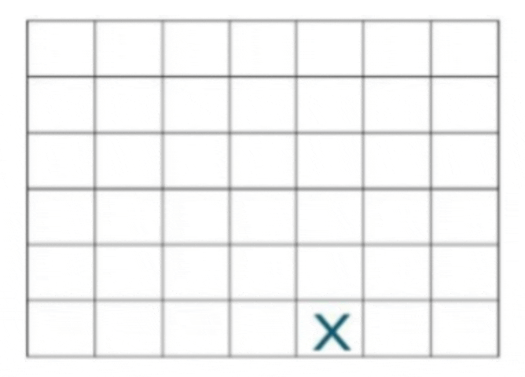

# Board-Games
8 Board Games based on OOP concepts using C++.

## George Games
1. **Pyramic Tic-Tac-Toe :**\
The game board is shaped like a pyramid. Five squares make the base, then three, then one.\
\
Players take turns marking Xs and Os as in traditional tic-tac-toe.\
\
The first player to get three-in-a-row vertically, horizontally, or diagonally wins. See
two examples of winning positions, below.

1. **Word Tic-tac-toe :** \
Word Tic-tac-toe is an innovative twist on the classic Tic-tac-toe game.
Instead of using "X" or "O", players place letters on a 3x3 grid to form valid words.\
\
This version adds a **linguistic challenge** to the traditional game mechanics. Players aim to form a valid word with the letters they place on the board. Words can be formed horizontally, vertically, or diagonally.\
\
Each player takes turns placing one letter on the board. A player must try to form a valid word with each move. Players can build upon existing letters to form words, provided that the resulting sequence is
a valid word.\
\
The game is won by forming a valid word horizontally, vertically, or diagonally. If the
board fills up without a valid word being formed, the game ends in a draw.

## Kerolus Games
1. **Four-in-a-row :** \
You will recognize four-in-a row as a two-dimensional version of the classic game, **Connect Four**.\
\
The game board consists of a 7 x 6 grid. Seven columns of six squares each. Instead of dropping counters as in Connect Four, players mark the grid with Xs and Os as in tic-tac-toe.\
\
The first player places an X in the bottom square of any column. Taking turns, players make their mark in any column, as long as it is in the lowest square possible.\
\
The first player to get four-in-a-row vertically, horizontally, or diagonally wins.\
\
See this example of possible first six moves.

1. **Numerical Tic-Tac-Toe :** \
Numerical Tic-Tac-Toe offers a mathematical twist to
the classic Tic-Tac-Toe game.\
\
Instead of the traditional "X" and "O", players use numbers to add an element of strategic calculation. The objective is to achieve a sum
of 15 with three numbers in a row, column, or diagonal.
Rules: Player 1 typically starts and uses odd numbers (1, 3, 5, 7, 9), while Player 2 uses even numbers (2, 4, 6, 8).\
\
Players alternate turns, placing one number in an empty cell on the board. Each number can only be used once.\
\
A player wins by placing three numbers in a row, column, or diagonal that add up to 15.\
\
If all cells are filled without achieving the sum of 15 in any line, the game ends in a draw.

## Marco Games
1. **5 x 5 Tic Tac Toe :** \
This tic-tac-toe variation is played on a 5 x 5 grid.\
\
As in the traditional game, players are Xs or Os.
Players take turns placing an X or an O in one of the squares until all the squares except one are filled. (Each player has 12 turns for a total of 24 squares.)\
\
Sequences can be vertically, horizontally, or diagonally. Whoever has the most, wins.\

1. **Misere Tic Tac Toe :**\
Misere Tic Tac Toe, also known as Inverse Tic Tac Toe or Toe Tac Tic, is a uniquetwist ontheclassic game.\
\
In this version, the objective is to avoid getting three marks in a row. The game flips the traditional win condition on its head, making every move a strategic decision to prevent losing.\
\
The game is played on a standard 3x3 Tic-Tac-Toe grid. The goal is to avoid placing three of your marks in a row, column, or diagonal.\
\
The player who ends up with three marks in a row loses the game. If all cells are filled without either player aligning three marks in a row, the game ends in a draw.
